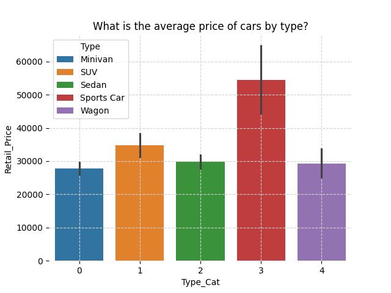
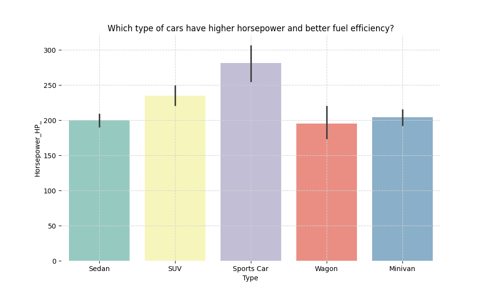
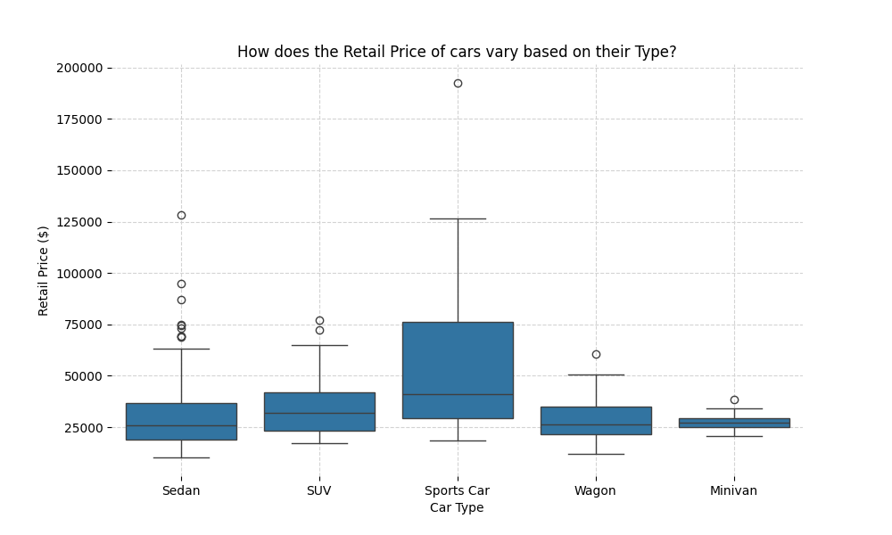

## About This Fork

This repository extends [Microsoft lida](https://github.com/microsoft/lida) by adding native support for automated data summarization and visualization using local Ollama large language models. With this enhancement, lida users are no longer limited to cloud-based LLM providers. Charts, summaries and infographics can now be generated locally on your own machine using any LLMs supported by [Ollama](https://ollama.com/library?sort=newest).

Testing showed that **llama3.1:8b** delivers the most reliable JSON-formatted output. Models with fewer parameters (<8b) were less consistent in producing valid JSON, leading to processing failures.


### Additional Supported LLM Providers

- **Ollama models** (added through the [`llmx-ollama-extension`](https://github.com/sunishbharat/llmx-ollama-extension) integration)

> **Note:** Ollama support is enabled via the `llmx-ollama-extension` repository. Make sure to install this extension for local model compatibility.

### Setup

Clone [lida-ollama-extension](https://github.com/sunishbharat/lida-ollama-extension):

```
git clone https://github.com/sunishbharat/lida-ollama-extension
cd lida-ollama-extension
```

### Remove existing LLMX (if installed) in environment
--------------------------------------------------
```
pip uninstall llmx
```

### Setup conda env
---------------
```
conda create --name <new_env> python=3.12.11
conda activate <new_env>
```

### Clone `llmx-ollama-extension` repo locally
-------------------------------------
It would be recommended to clone it outside the LIDA repo folder:
```
git clone https://github.com/sunishbharat/llmx-ollama-extension.git
cd llmx-ollama-extension
```


From within your llmx-ollama-extension folder:
```
pip install -e .
```

### Install lida and all necessary dependencies
----------------------------------------
Return to your lida repo folder:
```
cd ../lida-ollama-extension

pip install -e .

pip install -r requirements.txt
```
Install any extras or dev dependencies if needed:
```
pip install lida[dev]
```

### Install [ollama](https://ollama.com/)

#### After installing ollama, run ollama
```
ollama serve
```
#### To list available models:
```
ollama list
```
#### To download and run llama3.1:8b model
```
ollama run llama3.1:8b
```

### Usage
```python
from lida import Manager, TextGenerationConfig , llm

lida = Manager(text_gen = llm(provider="ollama", model="llama3.1:8b", model_name="llama3.1:8b"))
textgen_config = TextGenerationConfig(n=1, temperature=0.5, model="llama3.1:8b", use_cache=False)

summary = lida.summarize("https://raw.githubusercontent.com/uwdata/draco/master/data/cars.csv", 
                         summary_method="default", textgen_config=textgen_config)

goals = lida.goals(summary, n=2, textgen_config=textgen_config)

for goal in goals:
    display(goal)

```

### Generate Visualization via a "User query"
```python
user_query = "What is the average price of cars by type?"
textgen_config = TextGenerationConfig(n=1, temperature=0.2, use_cache=True)
charts = lida.visualize(summary=summary, goal=user_query, textgen_config=textgen_config)  
charts[0]
```




### Sample Output using `llama3.1:8b`

```
python lida\tests\test_components.py
```
```text
summary_enrich["dataset_description"]='This dataset contains information about various car models including their names,
types, prices, engine sizes, horsepower, city and highway miles per gallon, weight, wheel base, length, and width.
The data is based on real-world cars available in the US market.'

goal=Goal(question="What type of car has the highest average 'Retail_Price'?", visualization='bar chart of
Type vs Average(Retail_Price) using [Type, Retail_Price] from dataset', rationale='This will help identify which car types
are associated with higher prices. We can use bar charts instead of pie charts because they are more informative and easy
to read. This visualization is relevant for a data analyst who wants to understand the relationship between
Type and Retail Price.', index=0)

goal=Goal(question="What region has the highest number of 'City_Miles_Per_Gallon' over 60?", visualization='choropleth map of
City_Miles_Per_Gallon > 60 using [Name, City_Miles_Per_Gallon] from dataset', rationale="This will help us understand where cars
 with good fuel efficiency are located. We can use a choropleth map because it's easy to interpret and allows for spatial analysis.
This visualization is relevant for a data analyst who wants to identify areas with good fuel efficiency.", index=1)

goal=Goal(question='Which type of cars have higher horsepower and better fuel efficiency?', visualization='bar chart comparing
average Horsepower_HP_ by Type', rationale='This visualization will help us understand which types of cars (e.g. SUV, Minivan,
Sports Car) tend to have higher horsepower and better fuel efficiency, allowing the data analyst to identify trends in car
design and performance.', index=0)

```


### Sample Charts generated by `llama3.1:8b` model
   
